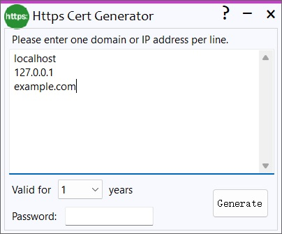

# HttpsCert Generator for Windows

[ [English](./README.md) | [简体中文](./README_cn.md) ]

This tool easily creates HTTPS certificates (SSL) for testing.

Based on [BouncyCastle](https://github.com/bcgit/bc-csharp).

Password is optional, if ".pfx" format is required, please set the password.
## Download

[Sourceforge](https://sourceforge.net/projects/https/) | [Github](https://github.com/lalakii/HttpsCert/releases)

## Demo

## License
[MIT](https://github.com/lalakii/HttpsCert/blob/master/LICENSE)