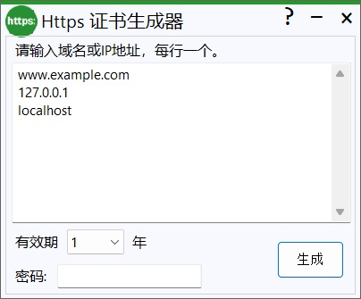

# Https 证书生成器 for Windows

[ [English](./README.md) | [简体中文](./README_cn.md) ]

为了更加方便地生成SSL证书用于测试，我制作了这个小工具

基于 [BouncyCastle](https://github.com/bcgit/bc-csharp) 实现

密码字段是可选项，当你需要生成.pfx格式的证书文件时，才需要设置它
## Download

[Sourceforge](https://sourceforge.net/projects/https/) | [Github](https://github.com/lalakii/HttpsCert/releases) | [蓝奏云](https://a01.lanzoui.com/iNhzv2metnja)

## Demo

## License
[MIT](https://github.com/lalakii/HttpsCert/blob/master/LICENSE)